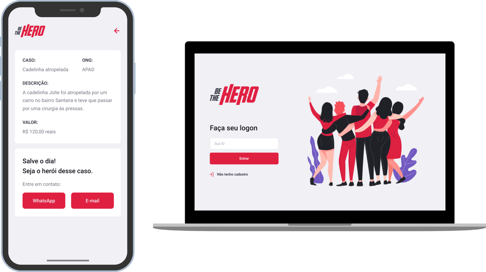

<h1 align="center">
    
</h1>

  A project that helps humans that want to contribute with money to non-governmental organizations.

 

  

## Technologies

The project was developed with the following technologies:

- [Node](https://nodejs.org/en/)
- [React](https://reactjs.org)
- [React Native](https://facebook.github.io/react-native/)
- [Expo](https://expo.io/)
- [Express](https://expressjs.com/)
- [Axios](https://github.com/axios/axios)
- [SQLite](https://www.sqlite.org/)
- [Knex](http://knexjs.org/)
- [Celebrate](https://github.com/arb/celebrate)

## Project

The project, entitled 'Be The Hero', was developed in a event called Omnistack Eleven from Rocketseat. The app, with frontend, backend and mobile was designed to make it easier for humans who want to contribute with money to non-governmental organizations.

Through the app, users can register, log in, access registered cases and contact organizations through email or whatsapp. Organizations can register, log in and publish cases that are visible to users. This can be make via desktop or smartphone.

## Installation

To install dependencies, run `npm install`. To start the project, enter in the folder desired (frontend, backend or mobile) and run `npm start`.

## Licence

The project is licensed through MIT License.
